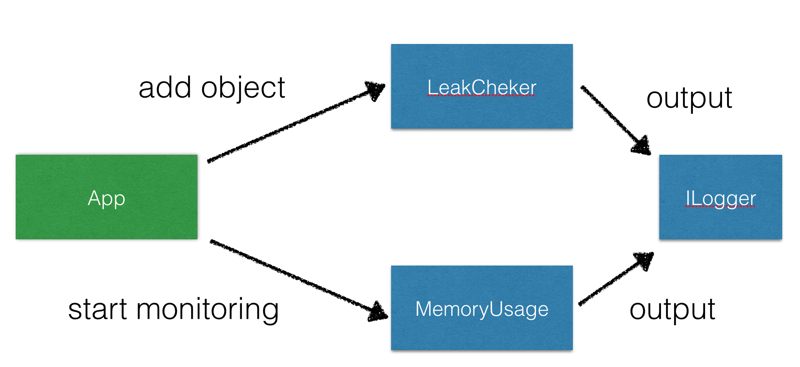
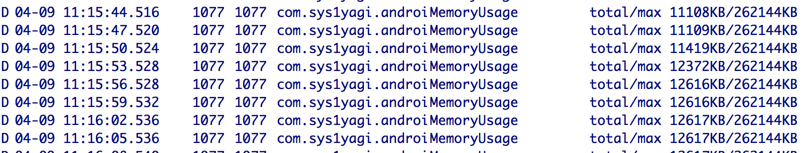
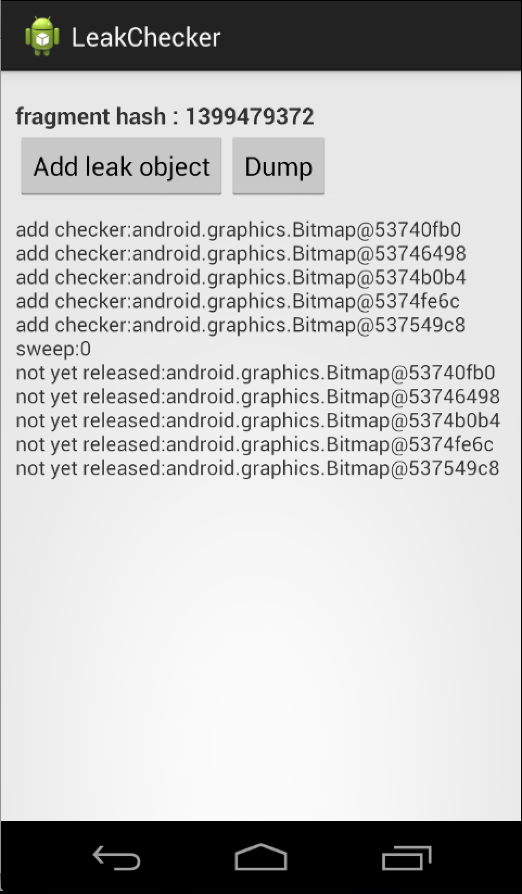
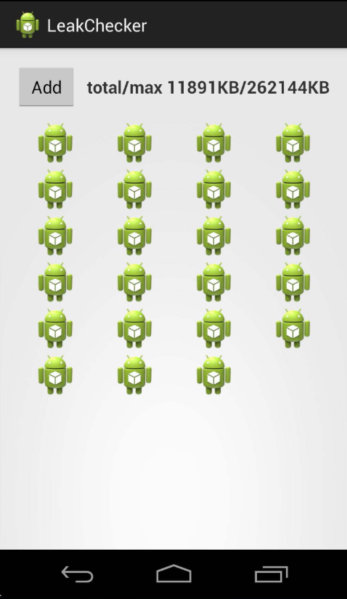

leak-checker
============

casual memory leak checker for Android.

## setup

build.gradle

```
apply plugin: 'android'

repositories {
    mavenCentral()
    maven { url 'https://raw.github.com/sys1yagi/leak-checker/master/repository' }
}

//...

dependencies {
    compile 'com.sys1yagi:leak-checker:0.0.1'
}
```


## modules

- LeakChecker
  - Monitor whether an object is leaking.
- MomoryUsage
  - Print the memory usage of application.
- ILogger
  - Receive information from each module.
  


## MemoryUsage

```
@Override
public void onCreate(Bundle savedInstanceState) {
  super.onCreate(savedInstanceState);
  MemoryUsage.startPrintMemoryUsage();
}

@Override
public void onDestroy() {
  super.onDestroy();
  MemoryUsage.stopPrintMemoryUsage();
}
```

default output to Logcat.



## LeakChecker

register object.

```
LeakChecker.addLeakChecker(bitmap)
```

dump the object of on-memory.

```
LeakChecker.dump()
```

example. [see sample](https://github.com/sys1yagi/leak-checker/tree/master/sample)



## Custom Logger

ex : output TextView.

```
public class TextViewMonitorLogger implements ILogger {
  private TextView target;

  public TextViewMonitorLogger(TextView target) {
    this.target = target;
  }

  @Override
  public void print(String tag, String message) {
    target.setText(message);
  }
}
```

set custom logger

```
LeakChecker.setLogger(logger);
MemoryUsage.setLogger(logger);
```

ex : display the memory usage in TextView

```
TextViewMonitorLogger logger = new TextViewMonitorLogger(textView);
MemoryUsage.setLogger(logger);
```




enjoy!

